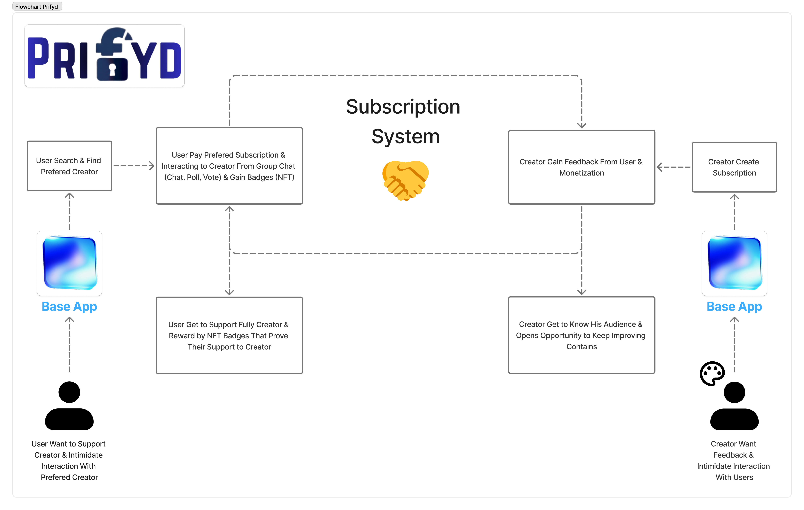

````markdown
# PRIFYD - Creator Subscription Platform

## 🔄 System Overview

Platform subscription berbasis blockchain yang menghubungkan **Creator** dengan **Users** melalui sistem tier (Bronze, Silver, Gold) dengan NFT badges sebagai bukti dukungan.



**Alur Sistem:**

- 👤 **User** → Cari creator favorit → Subscribe tier pilihan → Dapat NFT Badge
- 🎨 **Creator** → Buat subscription tiers → Terima pembayaran → Buat konten eksklusif

---

# FRONTEND

## Teknologi

- **Next.js**: v16.1.0
- **Wagmi**: v2.19.5
- **RainbowKit**: v2.2.10
- **Tailwind CSS**: v4.1.18

---

## Desain Frontend

Desain UI tersedia di Google Drive:  
[Link Desain Google Drive](https://drive.google.com/drive/folders/1uEAbpJPImF7Rb21D62fa5KU1BZiFZ_84?usp=sharing)

---

## Struktur Folder Frontend

```bash
src/
├─ components/    # Komponen UI
│  ├─ ui/
├─ app/           # Pages untuk Users
│  ├─ pages/
├─ context/       # Context API
├─ store/         # Zustand / Store
├─ config/        # Config Smart Contract
└─ abi/           # ABI Smart Contract
```
````

---

## Flow Frontend

**Public**


**Users**


**Creator →**

- Buat Subscription
- Buat Konten Exclusive

## Access Router Frontend

| Route                        | Component         | Access Level           | Description                              |
| ---------------------------- | ----------------- | ---------------------- | ---------------------------------------- |
| /                            | Home              | Public, Creator, Users | Halaman Home / Beranda                   |
| /pages/notif                 | NotificationPages | Creator, Users         | Notifikasi                               |
| /pages/search                | SearchPages       | Public, Creator, Users | Pencarian User                           |
| /pages/regist                | RegistCreators    | Users                  | Registrasi Creator                       |
| /pages/creator               | CreatorPages      | Users                  | Cari Creator untuk Subscribe             |
| /pages/subscribe             | SubscribePages    | Creator                | Buat Subscription                        |
| /pages/subscribe/:id_address | PaySubPages       | Users                  | Bayar Subscription: Bronze, Silver, Gold |
| /pages/profile               | ProfilePages      | Users, Creator         | Profile                                  |
| /pages/chating               | Chating           | Users, Creator         | Home Chating                             |
| /pages/chating/group         | CreatorChating    | Users, Creator         | Chating dengan Creator                   |
| /pages/chating/creator       | GroupChating      | Users, Creator         | Chating Group                            |

---

## Color Palette (Tailwind CSS)

```css
/* Background Mode Light & Dark */
Black: bg-black / #000000
White: bg-white / #FFFFFF

Gray: bg-gray-800 / #1F2937
Blue: bg-blue-800 / #1E40AF
Blue: bg-blue-300 / #93C5FD
```

---

## Wagmi & Smart Contract

### registerCreator

Registrasi creator baru di Subscription Manager Smart Contract.

```jsx
await useWriteContract({
  address, // Alamat kontrak
  abi, // ABI kontrak
  functionName: "registerCreator",
  args: [_handle, _name, _profileURI], // Handle, nama, profileURI
});

console.log(res);
```

**Parameters**:

- `_handle` (string) — username / handle creator
- `_name` (string) — nama creator
- `_profileURI` (string) — URI profile creator

---

### configureTiers

Konfigurasi harga subscription tier (Bronze, Silver, Gold).

```jsx
const res = useWriteContract({
  address,
  abi,
  functionName: "configureTiers",
  args: [bronzePrice, silverPrice, goldPrice],
});

console.log(res);
```

**Parameters**:

- **bronzePrice** (BigInt): `"100000000000000"`
- **silverPrice** (BigInt): `"500000000000000"`
- **goldPrice** (BigInt): `"1000000000000000"`

---

### getTierConfig

Membaca informasi tier subscription dari smart contract.

```jsx
const res = useContractRead({
  address,
  abi,
  functionName: "getTierConfig",
  args: [creator, tier], // creator address dan tier number
  watch: true,
});

console.log(res);
```

**Output** (`TierConfig`):

- `name` (string) — Nama tier
- `price` (uint256) — Harga dalam wei
- `duration` (uint256) — Durasi subscription (detik)
- `isActive` (bool) — Status aktif
- `metadataURI` (string) — URI metadata tambahan
- `maxSupply` (uint256) — Maksimum subscription allowed
- `minHoldTime` (uint256) — Minimum hold time

---

## Contoh Frontend Wagmi Usage

```jsx
import { useContractRead, useContractWrite } from "wagmi";
import SubscriptionABI from "@/abi/SubscriptionManager.json";

const contractAddress = "0x...";

function MyComponent() {
  const { data: tier } = useContractRead({
    address: contractAddress,
    abi: SubscriptionABI,
    functionName: "getTierConfig",
    args: ["0xCreatorAddress", 1], // Bronze tier
    watch: true,
  });

  const { write: registerCreator } = useContractWrite({
    address: contractAddress,
    abi: SubscriptionABI,
    functionName: "registerCreator",
    args: ["handle", "Name", "ipfs://profileURI"],
  });

  return (
    <div>
      <button onClick={() => registerCreator()}>Register Creator</button>
      <div>Tier Price: {tier?.price?.toString()}</div>
    </div>
  );
}
```

---

## Notes

- Semua alamat kontrak dan ABI harus disesuaikan dengan jaringan yang digunakan (Mainnet, Testnet, Local).
- Tailwind digunakan untuk styling responsif, termasuk dark mode support.
- RainbowKit digunakan untuk koneksi wallet user (Metamask, WalletConnect, dsb).
- Wagmi memudahkan interaksi smart contract secara reaktif dan watchable.

---

Ini sudah **versi lengkap README** untuk project frontend + smart contract kamu.

Jika mau, aku bisa bikin versi **lebih “developer-friendly” dengan diagram flow, state context, dan route map interaktif** supaya tim dev lebih mudah memahami.

Apakah mau aku buatkan juga versi itu?
