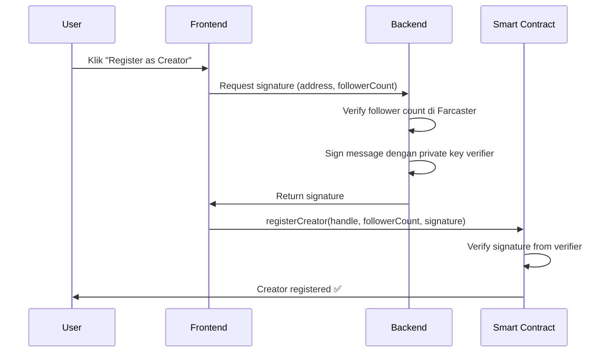

# Panduan Signature Verification - SubscriptionManager

## 🔐 Penjelasan Signature

Signature di `registerCreator()` digunakan untuk **memverifikasi follower count** dari backend, bukan signature dari wallet user.

### Alur Kerja:



## 🛠️ Mode Development (Testing tanpa Backend)

Saya sudah tambahkan `signatureRequired` toggle di contract. Untuk testing:

### 1. Deploy Contract

```solidity
// Set verifier ke address manapun (tidak masalah untuk testing)
constructor(
    badgeAddress,
    feeRecipient,
    0x0000000000000000000000000000000000000000  // verifier bisa zero address saat testing
)
```

### 2. Disable Signature Requirement

```javascript
// Setelah deploy, panggil function ini (sebagai owner)
await subscriptionManager.setSignatureRequired(false);
```

### 3. Register Creator Tanpa Signature

```javascript
// Sekarang bisa register dengan signature kosong
await subscriptionManager.registerCreator(
  "myhandle",
  10000, // followerCount >= MIN_FOLLOWER_COUNT
  "0x", // Empty signature
);
```

## 🚀 Mode Production (Dengan Backend Verification)

### Backend Signer Setup:

```javascript
// backend/utils/signer.js
const ethers = require("ethers");

// Private key dari wallet khusus untuk signing (JANGAN SHARE!)
const VERIFIER_PRIVATE_KEY = process.env.VERIFIER_PRIVATE_KEY;
const signer = new ethers.Wallet(VERIFIER_PRIVATE_KEY);

async function signFollowerCount(userAddress, followerCount, chainId) {
  // Sama persis dengan di smart contract (line 206-208)
  const messageHash = ethers.solidityPackedKeccak256(
    ["address", "uint256", "uint256"],
    [userAddress, followerCount, chainId],
  );

  // Sign dengan ethSign format (sesuai toEthSignedMessageHash di contract)
  const signature = await signer.signMessage(ethers.getBytes(messageHash));

  return signature;
}

module.exports = { signFollowerCount };
```

### Backend API Endpoint:

```javascript
// backend/routes/creator.js
app.post("/api/get-creator-signature", async (req, res) => {
  const { address } = req.body;

  try {
    // 1. Verify follower count dari Farcaster API
    const followerCount = await getFarcasterFollowerCount(address);

    if (followerCount < 10000) {
      return res.status(400).json({ error: "Insufficient followers" });
    }

    // 2. Sign message
    const chainId = 84532; // Base Sepolia
    const signature = await signFollowerCount(address, followerCount, chainId);

    // 3. Return ke frontend
    res.json({
      followerCount,
      signature,
    });
  } catch (error) {
    res.status(500).json({ error: error.message });
  }
});
```

### Frontend Integration:

```javascript
// frontend/utils/registerCreator.js
async function registerAsCreator(handle) {
  const signer = await provider.getSigner();
  const userAddress = await signer.getAddress();

  // 1. Get signature dari backend
  const response = await fetch("/api/get-creator-signature", {
    method: "POST",
    headers: { "Content-Type": "application/json" },
    body: JSON.stringify({ address: userAddress }),
  });

  const { followerCount, signature } = await response.json();

  // 2. Call smart contract
  const tx = await subscriptionManager.registerCreator(
    handle,
    followerCount,
    signature,
  );

  await tx.wait();
  console.log("Creator registered!");
}
```

## 📝 Deployment Checklist

### Development:

- [x] Deploy dengan verifier = address(0)
- [x] Call `setSignatureRequired(false)`
- [x] Register dengan signature "0x"

### Production:

- [ ] Generate wallet khusus untuk verifier
- [ ] Deploy dengan verifier = address dari wallet tersebut
- [ ] Save VERIFIER_PRIVATE_KEY di backend .env (RAHASIA!)
- [ ] Implement backend signing endpoint
- [ ] Call `setSignatureRequired(true)` (atau biarkan default)
- [ ] Test end-to-end registration flow

## ⚠️ Security Notes:

1. **Jangan** share `VERIFIER_PRIVATE_KEY`
2. **Jangan** commit private key ke Git
3. **Gunakan** environment variables di production
4. Backend harus verify follower count secara real dari Farcaster API
5. Rate limiting di backend endpoint untuk prevent spam

## 🔄 Switching Modes:

```solidity
// Owner bisa toggle kapan saja
subscriptionManager.setSignatureRequired(false);  // Development mode
subscriptionManager.setSignatureRequired(true);   // Production mode
```

## 📞 Error Messages:

- `VerifierNotSet`: Verifier address belum di-set (cek constructor)
- `InvalidSignature`: Signature tidak match dengan verifier
- `SignatureAlreadyUsed`: Signature sudah pernah dipakai (replay attack prevention)
- `InsufficientFollowers`: Follower count < 10,000
